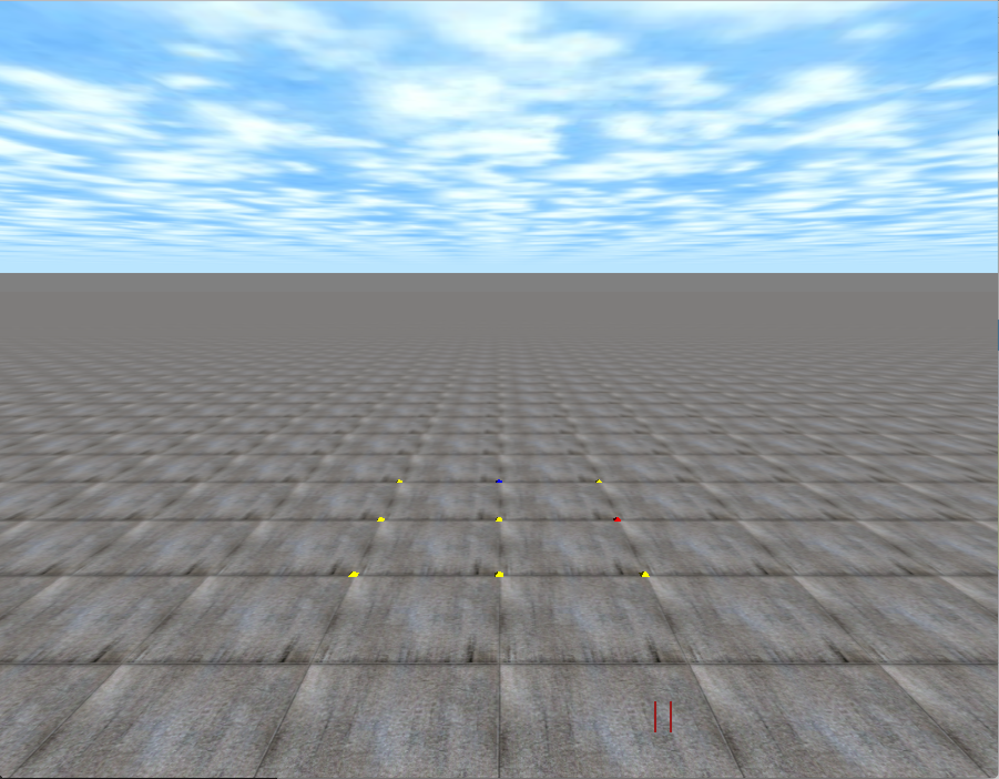

.. _quickstart:

Quick Start
===========

Here's the code you need to run a pyrosim simulator as fast as possible.

.. note::
    
    It is necessary to use ``sim.wait_to_finish()`` on Python 3.x

.. literalinclude:: ../../../demos/docs/empty.py

    Default empty simulator.
    Red lines in bottom right indicate simulator is paused at the moment.

