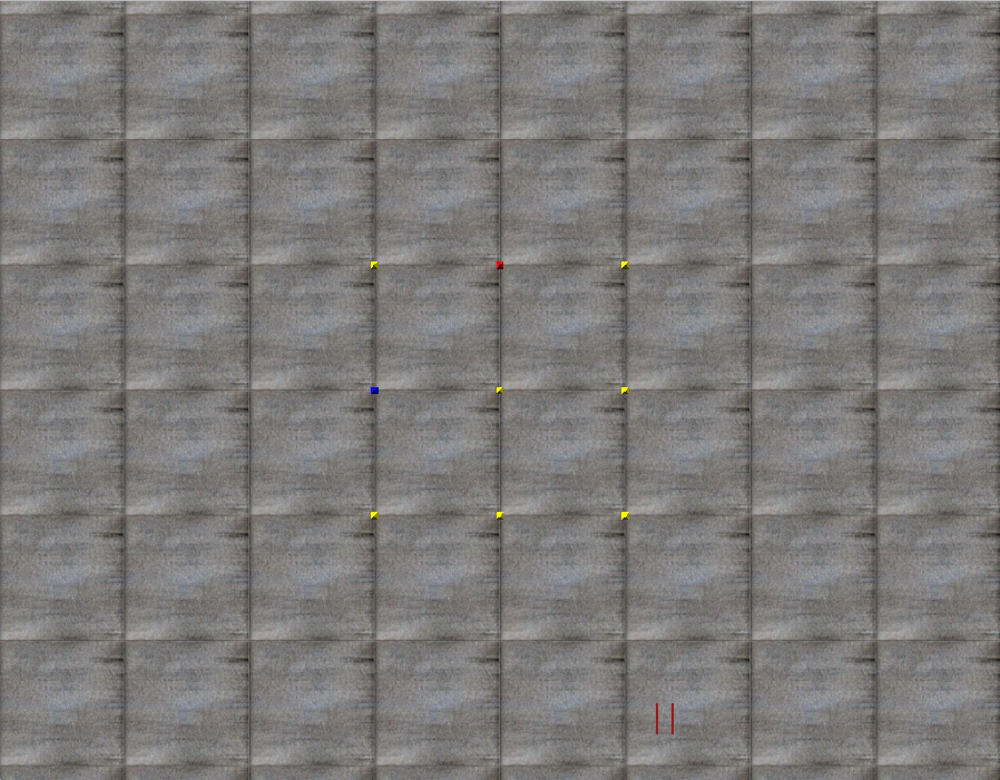

.. _simulator:

Basic Simulator Settings
========================

This page will detail the options you can specify to create different simulation environments for your robots.

Pausing
-------
By default, the simulator runs immediately.
You can pause the simulator before starting so that it is paused when it opens using the ``play_paused`` parameter

.. code-block:: python

    sim = pyrosim.Simulator(play_paused=True)

Alternatively, you can press *Ctrl-p* to pause while the simulator is running.

Timing Parameters
-----------------
With pyrosim you can specify the time between each simulation step ``dt``.
In general a smaller simulation step will lead to more stable simulation.
You can also specify how long you want the simulation to run for in terms of the number of steps to take by 
changing the parameter ``eval_steps``. For example:

.. code-block:: python
    
    sim = pyrosim.Simulator(dt=0.01, eval_steps=1000)

will run the simulator for 1000 time steps in increments of 0.01 seconds per step.
This gives 10 total seconds of simulation time.
Note that this will generally not be 10 seconds of human percieved time due to fps issues.

By setting ``eval_steps`` to a negative number, the simulator will run indefinitely.
This may be useful for debugging or visualization purposes.
To exit out of the simulator at any point press the 'x' key.

Running Headless
----------------
An important aspect of simulators is there ability to run quickly without a graphical component.
In pyrosim it is easy to run headless simulations by specifying the ``play_blind`` option.

.. code-block:: python
    
    sim = pyrosim.Simulator(play_blind=True)

Basic Camera Options
--------------------
You can spcify how to initially set up the camera when the simulator starts up.
Pyrosim uses the system of heading, pitch, and roll (``hpr``) to specify where the camera is looking.
``hpr`` is specified in degrees.
The user can also specify the position of the camera.
Camera options are set using the ``set_camera()`` method.
In the following example, the camera is place 5 units high looking down towards the ground:

.. code-block:: python
    
    sim = pyrosim.Simulator()
    sim.set_camera(xyz=[0, 0, 5], hpr=[0, -90, 0])

    Top-down view of the empty simulation.
    The red dot indicates one simulator unit in the **+x** direction.
    The blue dot indicates one simulator unit in the **+y** direction.

